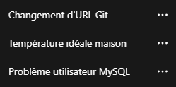

# Goodbye GPT

---

## English

OpenAI has announced an agreement with the Department of War (DoW) to deploy its models in classified military networks. While the company states its commitment to safety principles—including prohibitions on domestic mass surveillance and human responsibility for the use of force—this partnership raises questions for users who prefer to limit their data on OpenAI's services.

This extension lets you **bulk-delete all your ChatGPT conversations** from the web interface. It uses only DOM manipulation (simulated clicks), no external API. Use it to clear your history before closing your account, to reduce your footprint, or simply to take back control of your data.

### Installation

**Chrome**

1. Download or clone this folder.
2. Open Chrome and go to `chrome://extensions/`.
3. Enable **Developer mode** (toggle top-right).
4. Click **Load unpacked**.
5. Select the `goodbye-gpt` folder containing `manifest.json`.

**Firefox**

1. Open Firefox and go to `about:debugging#/runtime/this-firefox`.
2. Click **Load Temporary Add-on**.
3. Select the `manifest.json` file in the extension folder.

### Usage

1. Log in to [chatgpt.com](https://chatgpt.com/).
2. Make sure the **left sidebar** (conversation history) is visible.
3. If the three-dot options button (⋯) are missing for all conversation, right-click on it and choose **Inspect Element** to reveal it. Keep it open.

4. A red **"Supprimer tous les chats"** button appears in the center of the page.
5. Click it to start bulk deletion of all visible conversations.
6. The extension runs: open menu → Delete → Confirm, for each conversation.

### DOM selectors (maintenance)

If OpenAI changes the site structure and the extension breaks, update the selectors in `content-script.js`:

| Element | Selector |
|---------|----------|
| Conversation links | `#history a[href^="/c/"]` |
| Options button (⋯) | `button[data-testid^="history-item-"][data-testid$="-options"]` |
| Delete menu item | `[role="menuitem"][data-testid="delete-chat-menu-item"]` |
| Confirmation modal | `div[data-testid="modal-delete-conversation-confirmation"]` |
| Confirm button | `button[data-testid="delete-conversation-confirm-button"]` |

Inspect the DOM: right-click an element → **Inspect** (F12) → **Elements** tab.

### Compatibility

- Chrome (Manifest V3)
- Firefox (Manifest V3)
- Domain: `https://chatgpt.com/*` only

---

## Français

OpenAI a annoncé un accord avec le Department of War (DoW) pour déployer ses modèles dans des réseaux militaires classifiés. Si l'entreprise affirme son attachement à des principes de sécurité—notamment l'interdiction de la surveillance de masse domestique et la responsabilité humaine dans l'usage de la force—ce partenariat interroge les utilisateurs qui souhaitent limiter leurs données sur les services d'OpenAI.

Cette extension permet de **supprimer en masse toutes vos conversations ChatGPT** depuis l'interface web. Elle n'utilise que la manipulation du DOM (clics simulés), aucune API externe. Utilisez-la pour effacer votre historique avant de fermer votre compte, pour réduire votre empreinte, ou simplement pour reprendre le contrôle de vos données.

### Installation

**Chrome**

1. Téléchargez ou clonez ce dossier.
2. Ouvrez Chrome et allez sur `chrome://extensions/`.
3. Activez le **Mode développeur** (interrupteur en haut à droite).
4. Cliquez sur **Charger l'extension non empaquetée**.
5. Sélectionnez le dossier `goodbye-gpt` contenant `manifest.json`.

**Firefox**

1. Ouvrez Firefox et allez sur `about:debugging#/runtime/this-firefox`.
2. Cliquez sur **Charger un module complémentaire temporaire**.
3. Sélectionnez le fichier `manifest.json` dans le dossier de l'extension.

### Utilisation

1. Connectez-vous à [chatgpt.com](https://chatgpt.com/).
2. Assurez-vous que la **barre latérale gauche** (historique des conversations) est visible.
3. Si les 3 petits points (bouton options ⋯) n'apparaissent pas sur chaque conversation, faites un clic droit dessus puis cliquez sur **Inspecter l'élément** pour les afficher. 
Laissez le ouvert.

4. Un bouton rouge **« Supprimer tous les chats »** apparaît au centre de la page.
5. Cliquez dessus pour lancer la suppression en masse de toutes les conversations visibles.
6. L'extension enchaîne : ouvrir le menu → Supprimer → Confirmer, pour chaque conversation.

### Sélecteurs DOM (maintenance)

Si OpenAI modifie la structure du site et que l'extension ne fonctionne plus, adaptez les sélecteurs dans `content-script.js` :

| Élément | Sélecteur |
|---------|-----------|
| Liens des conversations | `#history a[href^="/c/"]` |
| Bouton options (⋯) | `button[data-testid^="history-item-"][data-testid$="-options"]` |
| Item menu « Supprimer » | `[role="menuitem"][data-testid="delete-chat-menu-item"]` |
| Modale de confirmation | `div[data-testid="modal-delete-conversation-confirmation"]` |
| Bouton de confirmation | `button[data-testid="delete-conversation-confirm-button"]` |

Pour inspecter le DOM : clic droit sur un élément → **Inspecter** (F12) → onglet **Elements**.

### Compatibilité

- Chrome (Manifest V3)
- Firefox (Manifest V3)
- Domaine : `https://chatgpt.com/*` uniquement

---

## License

MIT
